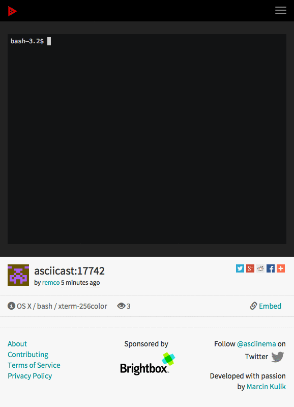

# Gister 

Manage your gists from the command-line.


## Create a github access token

* https://help.github.com/articles/creating-an-access-token-for-command-line-use/<F37>

## Install

```
$ brew tap dutchcoders/homebrew-gister
$ brew install gister
```

## Environment variables

* GITHUB_TOKEN: your github access token
* EDITOR: your favorite editor

## Usage

```
usage: gister --editor="vim" --token="GITHUB_TOKEN"
       [<flags>] <command> [<flags>] [<args> ...]

Flags:
  --help          Show help.
  --debug         enable debug mode
  --editor="EDITOR"  editor to use
  --token="GITHUB_TOKEN"
                  github token
  --description=DESCRIPTION
                  description
  --public        public gist

Commands:
  help [<command>]
    Show help for a command.

  list [<flags>]
    list gists

  search [<flags>] <keyword>
    search gists

  download --gist=GIST [<flags>] [<files>]
    download gist

  create [<files>]
    create new gist with specified files

  info --gist=GIST
    show info gist

  edit --gist=GIST
    edit gist using editor

  delete --gist=GIST
    delete specified gist
```

## Samples

**Create a new gist**
```
$ gister create
00da2a1fddaa77fb40e4
```

**List gists**
```
$ gister list
nl5887/00da2a1fddaa77fb40e4
nl5887/f74a0a0837f609af9552 test
nl5887/0f70d642f6c91f33535e Slack invite by email
```

**Search gists**
```
$ gister search test
nl5887/f74a0a0837f609af9552 test
```

**Edit**
```
$ gister edit f74a0a0837f609af9552
nl5887/f74a0a0837f609af9552 test
```

**Delete a gist**
```
$ gister delete --gist 960473f0df6f8e98d220
```

## Demo

[Asciinema](https://asciinema.org/a/17742)


## Contributions

Contributions are welcome.

## Creators

**Remco Verhoef**
- <https://twitter.com/remco_verhoef>
- <https://twitter.com/dutchcoders>

## Copyright and license

Code and documentation copyright 2011-2015 Remco Verhoef.

Code released under [the MIT license](LICENSE).

